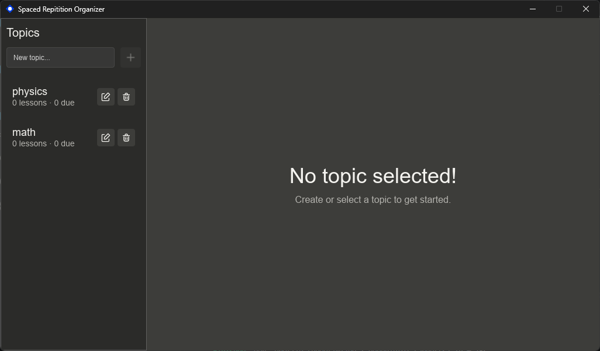
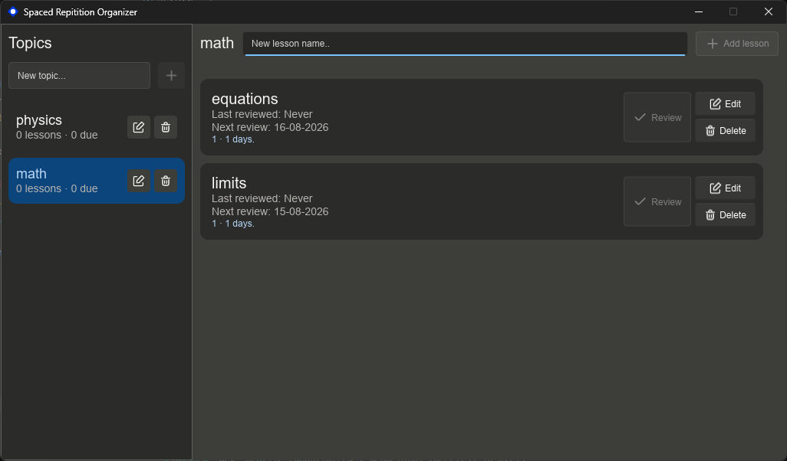

<div align="center">


# Spaced Repetition Organizer

**A fast, native spaced repetition study companion built with Rust and Slint.**


</div>

<br>

<div align="center">

</div>

<br>

## About

**SRO (Spaced Repetition Organizer)** helps you plan, schedule, and review study material using spaced repetition principles. Organize topics into lessons, track review intervals, and stay on top of what needs revisiting — all in a lightweight native desktop app with no browser overhead.

<br>

## ✨ Features

- 📚 **Topics & Lessons** — organize study material into structured topics with individual lessons
- 🔁 **Spaced Repetition Scheduling** — automatic interval-based review scheduling
- ⚡ **Native Performance** — instant startup, low memory footprint, no Electron
- 💾 **Local-First** — your data stays on your machine

<br>

## 🖼️ Screenshots

<div align="center">

<br><br>

</div>

<br>

## 🛠️ Tech Stack

| Layer       | Technology     |
|-------------|----------------|
| Language    | Rust           |
| UI Toolkit  | [Slint](https://slint.dev/) |
| Platform    | Windows        |

<br>

## 🚀 Getting Started

### Prerequisites

- [Rust](https://www.rust-lang.org/tools/install) (stable toolchain)
- Cargo (bundled with Rust)

### Build & Run

```bash
git clone https://github.com/yourusername/SRO.git
cd SRO
cargo run --release
```

### Build for Release

```bash
cargo build --release
```

The compiled binary will be available under `target/release/`.

<br>

## 📁 Project Structure

```
SRO/
├── src/
│   ├── main.rs
│   ├── database_manager.rs
│   └── models.rs
├── ui/
│   ├── app-window.slint
│   ├── models.slint
│   ├── components/
│   ├── dialogs/
│   ├── pages/
│   └── theme/
├── assets/
│   ├── icons/
│   └── app-icon.png
├── Cargo.toml
└── README.md
```

<br>

## 🗺️ Roadmap

- [ ] Import/export decks
- [ ] Statistics dashboard
- [ ] Custom review algorithms
- [ ] Cross-platform builds (macOS, Linux)

<br>

## 📄 License

This project is licensed under the MIT License — see the [LICENSE](LICENSE) file for details.

<br>

<div align="center">


<br><br>

Made with 🦀 and 💙


</div>
